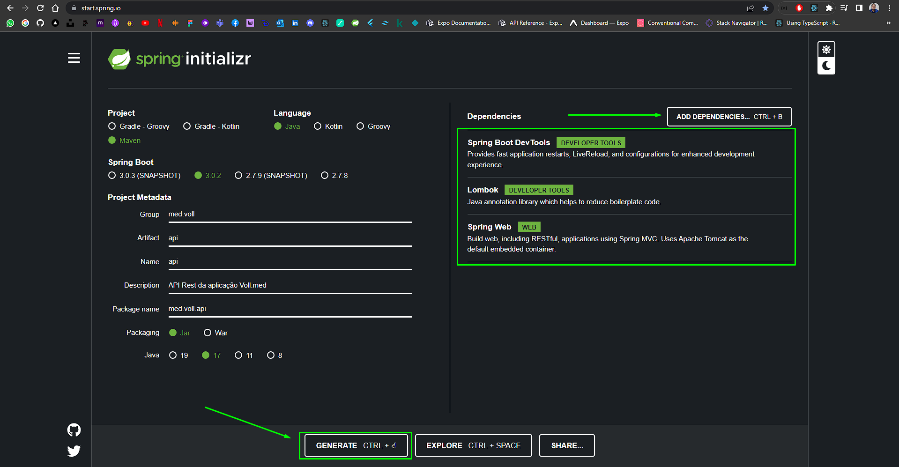
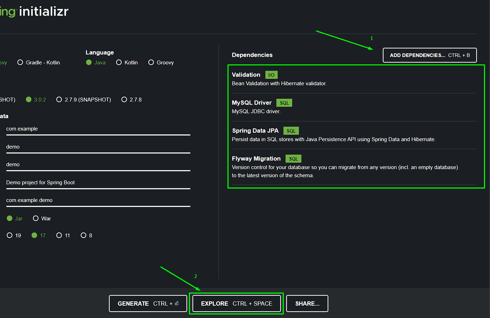
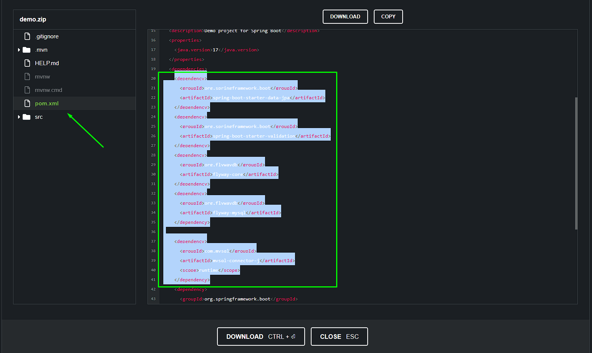

# VollMed - RestAPI with SpringBoot 3

   
### Link quadro Trello com a descrição das funcionalidades da API: https://trello.com/b/O0lGCsKb/api-voll-med
### Link do Layout do APP Mobile no Figma: https://trello.com/b/O0lGCsKb/api-voll-med
* Adicione algo novo como uma Classe ou Pacote clicando no diretório desejado (example med.voll.api) e pressionando <b>ALT + INSERT (or INS)<b/>.
* Auto reload do Spring Boot Devtools, deve ser configurado no Intellij IDE, em <b>Settings (ctrl + alt + s) -> Build, Execution, Deployment -> Compiler -> e marque a opção 'Build Project Automatically'<b/>. Também em <b>Settings (ctrl + alt + s) -> Advanced settings -> marque a opção 'Allow auto-making to start even if developed application is currently running'<b/>.
 
### Como gerar um novo projeto com Spring Initializr
#### * SpringBoot tem o servidor Tomcat embutido por padrão para execução da aplicação

### Como adicionar novas dependencias?
1. Acessar Spring Initializr e selecionar as dependecias que deseja (Dependencias que adicionamos para Validação e Persistencia de dados: Validation, MySQL Driver, Spring Data JPA e Flyway Migration) https://start.spring.io/
2. Após selecionar as dependencias, certifique de que é um PROJETO MAVEN, clicar em 'EXPLORE' e copiar as dependencias que foram inclusas no pom.xml. 
3. Colar as dependencias copiadas no projeto, no arquivo pom.xml
4. Na aba 'Maven' no canto superior direito do Inttellij, clique em reload, para que seja feito o download das dependencias, pare o projeto e rode-o novamente.

